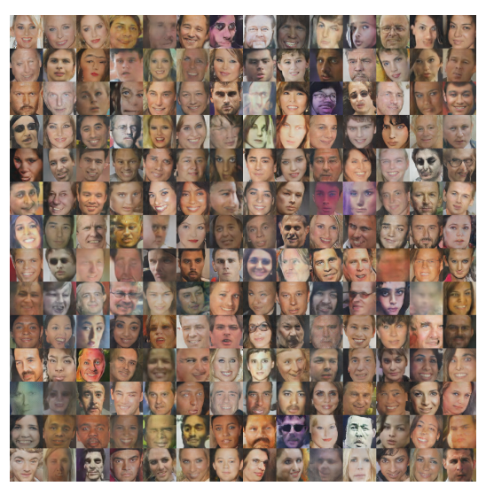
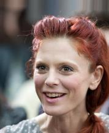

# CycleGAN
> If you have interesting ideas or data, please contact me quickly at wangzichaochaochao@gmail.com .


[Generative Adversarial Networks](https://arxiv.org/abs/1406.2661) (GANs) are one of the most interesting ideas in computer science today. Two models are trained simultaneously by an adversarial process. A generator ("the artist") learns to create images that look real, while a discriminator ("the art critic") learns to tell real images apart from fakes.


During training, the generator progressively becomes better at creating images that look real, while the discriminator becomes better at telling them apart. The process reaches equilibrium when the discriminator can no longer distinguish real images from fakes.

[DCGAN](https://arxiv.org/pdf/1511.06434.pdf) is used here to realize the function of face generation.

这儿使用 [DCGAN](https://arxiv.org/pdf/1511.06434.pdf) 来实现人脸生成功能。



---

## 代码用法 Code usage

You can use your own data or directly use the data of a predefined task.

你可以使用自己的数据或者直接使用预定义任务的数据。

CelebFaces Attributes (CelebA) Dataset https://www.kaggle.com/jessicali9530/celeba-dataset/home

### Require

+ python 3+, e.g. python==3.6
+ tensorflow version 2, e.g. tensorflow==2.0.0-beta1
+ tensorflow-datasets

### Train Model

```python
python train_dcgan_model.py
```

### Model Inference

```python
python inference_by_dcgan_model.py
```

## 人脸数据





